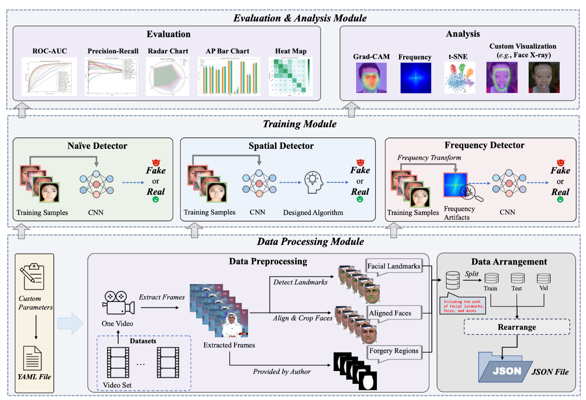

# DeepfakeBench: A Comprehensive Benchmark of Deepfake Detection

[](https://creativecommons.org/licenses/by-nc/4.0/)   

<p align="center">
<br>
  <a href="https://arxiv.org/abs/2307.01426" target="_blank"> Paper </a >  •  <a href="https://github.com/SCLBD/DeepfakeBench/releases/download/v1.0.0/Supplementary_DeepfakeBench.pdf"> Supplementary </a > <br>
<br>
</p >

<div style="text-align:center;">
  
</div>

Welcome to *DeepfakeBench*, your one-stop solution for deepfake detection! Here are some key features of our platform:

> ✅ **Unified Platform**: *DeepfakeBench* presents the first comprehensive benchmark for deepfake detection, resolving the issue of lack of standardization and uniformity in this field.
> 
> ✅ **Data Management**: *DeepfakeBench* provides a unified data management system that ensures consistent input across all detection models.
> 
> ✅ **Integrated Framework**: *DeepfakeBench* offers an integrated framework for the implementation of state-of-the-art detection methods.
> 
> ✅ **Standardized Evaluations**: *DeepfakeBench* introduces standardized evaluation metrics and protocols to enhance the transparency and reproducibility of performance evaluations.
> 
> ✅ **Extensive Analysis and Insights**: *DeepfakeBench* facilitates an extensive analysis from various perspectives, providing new insights to inspire the development of new technologies.

<font size=5><center><b> 📋 Table of Contents </b> </center></font>

- [DeepfakeBench: A Comprehensive Benchmark of Deepfake Detection](#deepfakebench-a-comprehensive-benchmark-of-deepfake-detection)
  - [Features](#features)
  - [Installation](#installation)
  - [Quick Start](#quick-start)
    - [Download Data](#download-data)
    - [Preprocessing](#preprocessing)
    - [Training](#training)
  - [Supported Detectors](#supported-detectors)
  - [Results](#results)
  - [Citation](#citation)
  - [Copyright](#copyright)

---


## 📚 Features
<a href="#top">[Back to top]</a>

DeepfakeBench has the following features:

⭐️  **Detectors** (15 detectors):
  - 5 Naive Detectors: [Xception](./training/detectors/xception_detector.py), [MesoNet](./training/detectors/meso4_detector.py), [MesoInception](./training/detectors/meso4Inception_detector.py), [CNN-Aug](./training/detectors/resnet34_detector.py), [EfficientNet-B4](./training/detectors/efficientnetb4_detector.py)
  - 7 Spatial Detectors: [Capsule](./training/detectors/capsule_net_detector.py), [DSP-FWA](./training/detectors/fwa_detector.py), [Face X-ray](./training/detectors/facexray_detector.py), [FFD](./training/detectors/ffd_detector.py), [CORE](./training/detectors/core_detector.py), [RECCE](./training/detectors/recce_detector.py), [UCF](./training/detectors/ucf_detector.py)
  - 3 Frequency Detectors: [F3Net](./training/detectors/f3net_detector.py), [SPSL](./training/detectors/spsl_detector.py), [SRM](./training/detectors/srm_detector.py)

⭐️ **Datasets** (9 datasets): [FaceForensics++](https://github.com/ondyari/FaceForensics), [FaceShifter](https://github.com/ondyari/FaceForensics/tree/master/dataset), [DeepfakeDetection](https://github.com/ondyari/FaceForensics/tree/master/dataset), [Deepfake Detection Challenge (Preview)](https://ai.facebook.com/datasets/dfdc/), [Deepfake Detection Challenge](https://www.kaggle.com/c/deepfake-detection-challenge/data), [Celeb-DF-v1](https://github.com/yuezunli/celeb-deepfakeforensics/tree/master/Celeb-DF-v1), [Celeb-DF-v2](https://github.com/yuezunli/celeb-deepfakeforensics), [DeepForensics-1.0](https://github.com/EndlessSora/DeeperForensics-1.0/tree/master/dataset), [UADFV](https://docs.google.com/forms/d/e/1FAIpQLScKPoOv15TIZ9Mn0nGScIVgKRM9tFWOmjh9eHKx57Yp-XcnxA/viewform)

DeepfakeBench will be continuously updated to track the lastest advances of deepfake detection.
The implementations of more detection methods, as well as their evaluations are on the way. **You are welcome to contribute your detection methods to DeepfakeBench.**


## ⏳ Quick Start

### 1. Installation
You can run the following script to configurate necessary environment

```
git clone git@github.com:SCLBD/DeepfakeBench.git
cd DeepfakeBench
conda create -n DeepfakeBench python=3.7.2
conda activate DeepfakeBench
sh install.sh
```

### 2. Download Data

<a href="#top">[Back to top]</a>

All datasets used in DeepfakeBench can be downloaded from their own websites or repositories.
For the convenience, we also provide the data we use in our research. All the downloaded datasets have been organized and arranged in the same folder. **Users can easily access and download the preprocessed data**, including original videos and corresponding mask videos, directly from we provided data, including:

| Dataset Name                 | Download Link (Baidu Netdisk)                                                  | Extract Code          | Notes |
| ---------------------------- | --------------------------------------------------------------- | ------------- | ----- |
| Celeb-DF-v1                  | [Download](https://pan.baidu.com/s/1s5KMI3Sy2nRNpCBEb47q9w) | wf2u | - |
| Celeb-DF-v2                  | [Download](https://pan.baidu.com/s/1Apca2Bgpwxvm9tNO6mUDpQ) | ra5t | - |
| FaceForensics++, DeepfakeDetection, FaceShifter              | [Download](https://pan.baidu.com/s/1BbnPS2I7DDhMzvGyj3i95w)                    | mvgi             | c23 version only |
| UADFV                        | [Download](https://pan.baidu.com/s/10-_ZW-TpOkdoY_fmESkIQA)                  | r0gc             | - |
| Deepfake Detection Challenge (Preview) | [Download](https://pan.baidu.com/s/1b56Msxi5n7gwVoBwhZsXGA)       | i3pa             | - |
| Deepfake Detection Challenge | Coming Soon                                                     | -             | - |
| DeepForensics-1.0           | Coming Soon                                                     | -             | - |
| FaceForensics++ (c40)           | Coming Soon                                                     | -             | - |

**Please note**: We have encrypted and compressed the dataset, so you will need to enter the password: `123456`, to decompress each dataset file. Alternatively, you can directly run [`./unzip.sh`](./unzip.sh) file to decompress all compressed files (currently limited to `.zip` format) in the [`./datasets`](./datasets/) folder. 
Other detailed information about the datasets used in DeepfakeBench is summarized below:


| Dataset | Real Videos | Fake Videos | Total Videos | Rights Cleared | Total Subjects | Synthesis Methods | Perturbations | Original Repository |
| --- | --- | --- | --- | --- | --- | --- | --- | --- |
| FaceForensics++ | 1000 | 4000 | 5000 | NO | N/A | 4 | 2 | [Hyper-link](https://github.com/ondyari/FaceForensics/tree/master/dataset) |
| FaceShifter | 1000 | 1000 | 2000 | NO | N/A | 1 | - | [Hyper-link](https://github.com/ondyari/FaceForensics/tree/master/dataset) |
| DeepfakeDetection | 363 | 3000 | 3363 | YES | 28 | 5 | - | [Hyper-link](https://github.com/ondyari/FaceForensics/tree/master/dataset) |
| Deepfake Detection Challenge (Preview) | 1131 | 4119 | 5250 | YES | 66 | 2 | 3 | [Hyper-link](https://ai.facebook.com/datasets/dfdc/) |
| Deepfake Detection Challenge | 23654 | 104500 | 128154 | YES | 960 | 8 | 19 | [Hyper-link](https://www.kaggle.com/c/deepfake-detection-challenge/data) |
| CelebDF-v1 | 408 | 795 | 1203 | NO | N/A | 1 | - | [Hyper-link](https://github.com/yuezunli/celeb-deepfakeforensics/tree/master/Celeb-DF-v1) |
| CelebDF-v2 | 590 | 5639 | 6229 | NO | 59 | 1 | - | [Hyper-link](https://github.com/yuezunli/celeb-deepfakeforensics) |
| DeepForensics-1.0 | 50000 | 10000 | 60000 | YES | 100 | 1 | 7 | [Hyper-link](https://github.com/EndlessSora/DeeperForensics-1.0/tree/master/dataset) |
| UADFV | 49 | 49 | 98 | NO | 49 | 1 | - | [Hyper-link](https://docs.google.com/forms/d/e/1FAIpQLScKPoOv15TIZ9Mn0nGScIVgKRM9tFWOmjh9eHKx57Yp-XcnxA/viewform) |


Upon downloading your datasets, please ensure to store them in the [`./datasets`](./datasets/) folder, arranging them in accordance with the directory structure outlined below:

```
datasets
├── FaceForensics++
│   ├── original_sequences
│   │   ├── youtube
│   │   │   ├── c23
│   │   │   │   ├── videos
│   │   │   │   │   └── *.mp4
│   ├── manipulated_sequences
│   │   ├── Deepfakes
│   │   │   ├── c23
│   │   │   │   └── videos
│   │   ├── Face2Face
│   │   │   ├── c23
│   │   │   │   └── videos
│   │   ├── FaceSwap
│   │   │   ├── c23
│   │   │   │   └── videos
│   │   ├── NeuralTextures
│   │   │   ├── c23
│   │   │   │   └── videos
│   │   ├── FaceShifter
│   │   │   ├── c23
│   │   │   │   └── videos
│   │   └── DeepFakeDetection
│   │       ├── c23
│   │       │   └── videos
│
├── Celeb-DF-v1/v2
│   ├── Celeb-synthesis
│   │   └── videos
│   ├── Celeb-real
│   │   └── videos
│   └── YouTube-real
│       └── videos
│
├── DFDCP
│   ├── method_A
│   ├── method_B
│   └── original_videos
│
├── DeeperForensics-1.0
│   ├── manipulated_videos
│   └── source_videos
│
└── ...
```

If you choose to store your datasets in a different folder, for instance, `./deepfake/data`, it's important to reflect this change in the dataset path in the [config.yaml](./preprocessing/config.yaml) for preprocessing purposes.


### 3. Preprocessing

<a href="#top">[Back to top]</a>

For the preprocessing module, we mainly provide two scripts: preprocessing and arrangement. 
- **The preprocessing script** in DeepfakeBench follows a sequential workflow for face detection, alignment, and cropping. The processed data, including face images, landmarks, and masks, are saved in separate folders for further analysis.
- **The rearrangement script** simplifies the handling of different datasets by providing a unified and convenient way to load them. The function eliminates the need to write separate input/output (I/O) code for each dataset, reducing duplication of effort and easing data management.

To start preprocessing your dataset, please follow these steps:

1. Download the [shape_predictor_81_face_landmarks.dat](https://github.com/SCLBD/DeepfakeBench/releases/download/v1.0.0/shape_predictor_81_face_landmarks.dat) file. Then, copy the downloaded shape_predictor_81_face_landmarks.dat file into the [`./preprocessing/dlib_tools`](./preprocessing/dlib_tools) folder. This file is necessary for Dlib's face detection functionality.

2. Open the [`./preprocessing/config.yaml`](./preprocessing/config.yaml) and locate the line `default: DATASET_YOU_SPECIFY`. Replace `DATASET_YOU_SPECIFY` with the name of the dataset you want to preprocess, such as `FaceForensics++`.

7. Specify the `dataset_root_path` in the config.yaml file. Search for the line that mentions dataset_root_path. By default, it looks like this: ``dataset_root_path: ./datasets``.
Replace `./datasets` with the actual path to the folder where your dataset is arranged. 

Once you have completed these steps, you can proceed with running the following line to do the preprocessing:

```shell
python preprocess.py
```

Second, after the preprocessing above, you will obtain the processed data for each dataset you specify. Similarly, you need to set the parameters in [config.yaml](./preprocessing/config.yaml) for each dataset. After that, run the following line:
```
python rearrange.py
```
After running the above line, you will obtain the json files for each dataset in the [`./preprocessing/dataset_json`](./preprocessing/dataset_json/) folder. The rearranged structure organizes the data in a hierarchical manner, grouping videos based on their labels and data splits (*i.e.,* train, test, validation). Each video is represented as a dictionary entry containing relevant metadata, including file paths, labels, compression levels (if applicable), *etc*. 


### 4. Pretrained Weights

<a href="#top">[Back to top]</a>

To run the training code, you should first download the pretrained weights for the corresponding backbones. You can download them from [Link](https://github.com/SCLBD/DeepfakeBench/releases/download/v1.0.0/pretrained.zip). After downloading, you need to put all the weights files into the folder [`./training/pretrained/`](./training/pretrained/).


### 5. Training

<a href="#top">[Back to top]</a>

You should first go to the [`./training/config/detector/`](./training/config/detector/) folder and then Choose the detector to be trained. For instance, you can adjust the parameters in [`xception.yaml`](./training/config/detector/xception.yaml) to specify the parameters, *e.g.,* training and testing datasets, epoch, frame_num, *etc*.

After setting the parameters, you can run with the following to train Xception detector:

```
python train.py \
--detector_path ./training/config/detector/xception.yaml
```

You can also adjust the training and testing parameters using the command line, for example:

```
python train.py \
--detector_path ./training/config/detector/xception.yaml  \
--train_dataset FaceForensics++ --testing_dataset Celeb-DF-v1
```

By default, the checkpoints and features will be saved during the training process. If you do not want to save them, run with the following:

```
python train.py \
--detector_path ./training/config/detector/xception.yaml \
--train_dataset FaceForensics++ --testing_dataset Celeb-DF-v1 \
--no-save_ckpt \
--no-save_feat
```

To train other detectors using the code mentioned above, you can specify the config file accordingly. However, for the Face X-ray detector, an additional step is required before training. To save training time, a pickle file is generated to store the Top-N nearest images for each given image. To generate this file, you should run the [`generate_xray_nearest.py`](./training/dataset/generate_xray_nearest.py) file. Once the pickle file is created, you can train the Face X-ray detector using the same way above.


## 📦 Supported Detectors

<a href="#top">[Back to top]</a>

|                  | File name                               | Paper                                                                                                                                                                                                                                                                                                                                                         |
|------------------|-----------------------------------------|---------------------------------------------------------------------------------------------------------------------------------------------------------------------------------------------------------------------------------------------------------------------------------------------------------------------------------------------------------------|
| Xception          | [xception_detector.py](./training/detectors/xception_detector.py)         | [FaceForensics++: Learning to Detect Manipulated Facial Images](https://openaccess.thecvf.com/content_ICCV_2019/html/Rossler_FaceForensics_Learning_to_Detect_Manipulated_Facial_Images_ICCV_2019_paper.html) ICCV 2019 |
| Meso4          | [meso4_detector.py](./training/detectors/meso4_detector.py)       | [MesoNet: a Compact Facial Video Forgery Detection Network](https://ieeexplore.ieee.org/abstract/document/8630761/) WIFS 2018                                                                                                                                                                                                                                     |
| Meso4Inception          | [meso4Inception_detector.py](./training/detectors/meso4Inception_detector.py)       | [MesoNet: a Compact Facial Video Forgery Detection Network](https://ieeexplore.ieee.org/abstract/document/8630761/) WIFS 2018                                                                                                                                                                                                                                             |
| CNN-Aug              | [resnet34_detector.py](./training/detectors/resnet34_detector.py)               | [CNN-generated images are surprisingly easy to spot... for now](https://openaccess.thecvf.com/content_CVPR_2020/papers/Wang_CNN-Generated_Images_Are_Surprisingly_Easy_to_Spot..._for_Now_CVPR_2020_paper.pdf) CVPR 2020                                            |
| EfficientNet-B4      | [efficientnetb4_detector.py](./training/detectors/efficientnetb4_detector.py) | [Efficientnet: Rethinking model scaling for convolutional neural networks](http://proceedings.mlr.press/v97/tan19a.html) ICML 2019                                                                                                                                                                                                                 |
| Capsule | [capsule_net_detector.py](./training/detectors/capsule_net_detector.py)                 | [Capsule-Forensics: Using Capsule Networks to Detect Forged Images and Videos](https://ieeexplore.ieee.org/abstract/document/8682602) ICASSP 2019                                                                                                 |
| DSP-FWA    | [fwa_detector.py](./training/detectors/fwa_detector.py)                 | [Exposing DeepFake Videos By Detecting Face Warping Artifacts](https://openaccess.thecvf.com/content_CVPRW_2019/papers/Media%20Forensics/Li_Exposing_DeepFake_Videos_By_Detecting_Face_Warping_Artifacts_CVPRW_2019_paper.pdf) CVPRW 2019                                                                                                                                |
| Face X-ray             | [facexray_detector.py](./training/detectors/facexray_detector.py)             | [Face X-ray for More General Face Forgery Detection](https://openaccess.thecvf.com/content_CVPR_2020/papers/Li_Face_X-Ray_for_More_General_Face_Forgery_Detection_CVPR_2020_paper.pdf) CVPR 2020                                                                                                                                               |
| FFD              | [ffd_detector.py](./training/detectors/ffd_detector.py)               | [On the Detection of Digital Face Manipulation](http://cvlab.cse.msu.edu/pdfs/dang_liu_stehouwer_liu_jain_cvpr2020.pdf) CVPR 2020                                                                                                                                                                                                                                           |
| CORE             | [facexray_detector.py](./training/detectors/facexray_detector.py)             | [CORE: COnsistent REpresentation Learning for Face Forgery Detection](https://openaccess.thecvf.com/content/CVPR2022W/WMF/papers/Ni_CORE_COnsistent_REpresentation_Learning_for_Face_Forgery_Detection_CVPRW_2022_paper.pdf) CVPRW 2022                                                                                                                                                    |
| RECCE         | [recce_detector.py](./training/detectors/recce_detector.py)     | [End-to-End Reconstruction-Classification Learning for Face Forgery Detection](https://openaccess.thecvf.com/content/CVPR2022/papers/Cao_End-to-End_Reconstruction-Classification_Learning_for_Face_Forgery_Detection_CVPR_2022_paper.pdf) CVPR 2022                                                                                                                                                                                               |
| UCF            | [ucf_detector.py](./training/detectors/ucf_detector.py)           | [UCF: Uncovering Common Features for Generalizable Deepfake Detection](https://arxiv.org/pdf/2304.13949.pdf) ArXiv 2023                                                                                                                                                                                   |
| F3Net  | [f3net_detector.py](./training/detectors/f3net_detector.py)     | [Thinking in Frequency: Face Forgery Detection by Mining Frequency-aware Clues](https://www.ecva.net/papers/eccv_2020/papers_ECCV/papers/123570086.pdf) ECCV 2020                                                                                                                                                                                                                                                                                 |
| SPSL   | [spsl_detector.py](./training/detectors/spsl_detector.py)       | [Spatial-Phase Shallow Learning: Rethinking Face Forgery Detection in Frequency Domain](https://openaccess.thecvf.com/content/CVPR2021/papers/Liu_Spatial-Phase_Shallow_Learning_Rethinking_Face_Forgery_Detection_in_Frequency_Domain_CVPR_2021_paper.pdf) CVPR 2021                                                                                                                                                                                                                                                                   |
| SRM    | [srm_detector.py](./training/detectors/srm_detector.py)         | [Generalizing Face Forgery Detection with High-frequency Features](https://openaccess.thecvf.com/content/CVPR2021/papers/Luo_Generalizing_Face_Forgery_Detection_With_High-Frequency_Features_CVPR_2021_paper.pdf) CVPR 2021                                                       |


## 🏆 Results

<a href="#top">[Back to top]</a>

In our Benchmark, we apply [TensorBoard](https://github.com/tensorflow/tensorboard) to monitor the progress of training models. It provides a visual representation of the training process, allowing users to examine training results conveniently.

To demonstrate the effectiveness of different detectors, we present partial results from both within-domain and cross-domain evaluations. The evaluation metric used is the Area Under the Curve (AUC). In this particular scenario, we train the detectors on the FF++ (c23) dataset and assess their performance on other datasets.

For a comprehensive overview of the results, we strongly recommend referring to our [main paper](https://arxiv.org/abs/2307.01426) and [supplementary materials](https://github.com/SCLBD/DeepfakeBench/releases/download/v1.0.0/Supplementary_DeepfakeBench.pdf). These resources provide a detailed analysis of the training outcomes and offer a deeper understanding of the methodology and findings.


| Type     | Detector   | Backbone  | FF++\_c23 | FF++\_c40 | FF-DF   | FF-F2F  | FF-FS   | FF-NT   | Avg.     | Top3 | CDFv1   | CDFv2   | DF-1.0  | DFD     | DFDC    | DFDCP   | Fsh     | UADFV   | Avg.    | Top3 |
|----------|------------|-----------|------------|------------|---------|---------|---------|---------|----------|------|---------|---------|---------|---------|---------|---------|---------|---------|---------|------|
| Naive    | Meso4      | MesoNet   | 0.6077     | 0.5920     | 0.6771  | 0.6170  | 0.5946  | 0.5701  | 0.6097   | 0    | 0.7358  | 0.6091  | 0.9113  | 0.5481  | 0.5560  | 0.5994  | 0.5660  | 0.7150  | 0.6551 | 1    |
| Naive    | MesoIncep  | MesoNet   | 0.7583     | 0.7278     | 0.8542  | 0.8087  | 0.7421  | 0.6517  | 0.7571   | 0    | 0.7366  | 0.6966  | 0.9233  | 0.6069  | 0.6226  | 0.7561  | 0.6438  | 0.9049  | 0.7364 | 3    |
| Naive    | CNN-Aug    | ResNet    | 0.8493     | 0.7846     | 0.9048  | 0.8788  | 0.9026  | 0.7313  | 0.8419   | 0    | 0.7420  | 0.7027  | 0.7993  | 0.6464  | 0.6361  | 0.6170  | 0.5985  | 0.8739  | 0.7020 | 0    |
| Naive    | Xception   | Xception  | 0.9637     | 0.8261     | 0.9799  | 0.9785  | 0.9833  | 0.9385  | 0.9450   | 4    | 0.7794  | 0.7365  | 0.8341  | **0.8163**  | 0.7077  | 0.7374  | 0.6249  | 0.9379  | 0.7718 | 2    |
| Naive    | EfficientB4| Efficient | 0.9567     | 0.8150     | 0.9757  | 0.9758  | 0.9797  | 0.9308  | 0.9389   | 0    | 0.7909  | 0.7487  | 0.8330  | 0.8148  | 0.6955  | 0.7283  | 0.6162  | 0.9472  | 0.7718 | 3    |
| Spatial  | Capsule    | Capsule   | 0.8421     | 0.7040     | 0.8669  | 0.8634  | 0.8734  | 0.7804  | 0.8217   | 0    | 0.7909  | 0.7472  | 0.9107  | 0.6841  | 0.6465  | 0.6568  | 0.6465  | 0.9078  | 0.7488 | 2    |
| Spatial  | FWA        | Xception  | 0.8765     | 0.7357     | 0.9210  | 0.9000  | 0.8843  | 0.8120  | 0.8549   | 0    | 0.7897  | 0.6680  | **0.9334**  | 0.7403  | 0.6132  | 0.6375  | 0.5551  | 0.8539  | 0.7239 | 1    |
| Spatial  | Face X-ray      | HRNet     | 0.9592     | 0.7925     | 0.9794  | **0.9872**  | 0.9871  | 0.9290  | 0.9391   | 3    | 0.7093  | 0.6786  | 0.5531  | 0.7655  | 0.6326  | 0.6942  | **0.6553**  | 0.8989  | 0.6985 | 0    |
| Spatial  | FFD        | Xception  | 0.9624     | 0.8237     | 0.9803  | 0.9784  | 0.9853  | 0.9306  | 0.9434   | 1    | 0.7840  | 0.7435  | 0.8609  | 0.8024  | 0.7029  | 0.7426  | 0.6056  | 0.9450  | 0.7733 | 1    |
| Spatial  | CORE       | Xception  | 0.9638     | 0.8194     | 0.9787  | 0.9803  | 0.9823  | 0.9339  | 0.9431   | 2    | 0.7798  | 0.7428  | 0.8475  | 0.8018  | 0.7049  | 0.7341  | 0.6032  | 0.9412  | 0.7694 | 0    |
| Spatial  | Recce      | Designed  | 0.9621     | 0.8190     | 0.9797  | 0.9779  | 0.9785  | 0.9357  | 0.9422   | 1    | 0.7677  | 0.7319  | 0.7985  | 0.8119  | 0.7133  | 0.7419  | 0.6095  | 0.9446  | 0.7649 | 2    |
| Spatial  | UCF        | Xception  | **0.9705** | **0.8399** | **0.9883** | 0.9840  | **0.9896** | **0.9441** | **0.9527** | **6** | 0.7793  | 0.7527  | 0.8241  | 0.8074  | **0.7191**  | **0.7594**  | 0.6462  | **0.9528**  | 0.7801 | **5** |
| Frequency| F3Net      | Xception  | 0.9635     | 0.8271     | 0.9793  | 0.9796  | 0.9844  | 0.9354  | 0.9449   | 1    | 0.7769  | 0.7352  | 0.8431  | 0.7975  | 0.7021  | 0.7354  | 0.5914  | 0.9347  | 0.7645 | 0    |
| Frequency| SPSL       | Xception  | 0.9610     | 0.8174     | 0.9781  | 0.9754  | 0.9829  | 0.9299  | 0.9408   | 0    | **0.8150**  | **0.7650**  | 0.8767  | 0.8122  | 0.7040  | 0.7408  | 0.6437  | 0.9424  | **0.7875** | 3    |
| Frequency| SRM        | Xception  | 0.9576     | 0.8114     | 0.9733  | 0.9696  | 0.9740  | 0.9295  | 0.9359   | 0    | 0.7926  | 0.7552  | 0.8638  | 0.8120  | 0.6995  | 0.7408  | 0.6014  | 0.9427  | 0.7760 | 2    |


In the above table, "Avg." donates the average AUC for within-domain and cross-domain evaluation, and the overall results. "Top3" represents the count of each method ranks within the top-3 across all testing datasets. The best-performing method for each column is highlighted.


Also, we provide all experimental results in [Link (code: qjpd)](https://pan.baidu.com/s/1Mgo5rW08B3ee_8ZBC3EXJA?pwd=qjpd). You can use these results for further analysis using the code in [`./analysis`](`./analysis`) folder. You can run these codes to **reproduce the results** in our original paper.


## 📝 Citation

<a href="#top">[Back to top]</a>

If interested, you can read our recent works about deepfake detection, and more works about trustworthy AI can be found [here](https://sites.google.com/site/baoyuanwu2015/home).

```
@article{yan2023deepfakebench,
  title={DeepfakeBench: A Comprehensive Benchmark of Deepfake Detection},
  author={Yan, Zhiyuan and Zhang, Yong and Yuan, Xinhang and Lyu, Siwei and Wu, Baoyuan},
  journal={arXiv preprint arXiv:2307.01426},
  year={2023}
}

@article{yan2023ucf,
  title={UCF: Uncovering Common Features for Generalizable Deepfake Detection},
  author={Yan, Zhiyuan and Zhang, Yong and Fan, Yanbo and Wu, Baoyuan},
  journal={arXiv preprint arXiv:2304.13949},
  year={2023}
}
```


## 🛡️ License

<a href="#top">[Back to top]</a>


This repository is licensed by [The Chinese University of Hong Kong, Shenzhen](https://www.cuhk.edu.cn/en) under Creative Commons Attribution-NonCommercial 4.0 International Public License (identified as [CC BY-NC-4.0 in SPDX](https://spdx.org/licenses/)). More details about the license could be found in [LICENSE](./LICENSE).

This project is built by the Secure Computing Lab of Big Data (SCLBD) at The School of Data Science (SDS) of The Chinese University of Hong Kong, Shenzhen, directed by Professor [Baoyuan Wu](https://sites.google.com/site/baoyuanwu2015/home). SCLBD focuses on the research of trustworthy AI, including backdoor learning, adversarial examples, federated learning, fairness, etc.

If you have any suggestions, comments, or wish to contribute code or propose methods, we warmly welcome your input. Please contact us at wubaoyuan@cuhk.edu.cn or yanzhiyuan1114@gmail.com. We look forward to collaborating with you in pushing the boundaries of deepfake detection.
